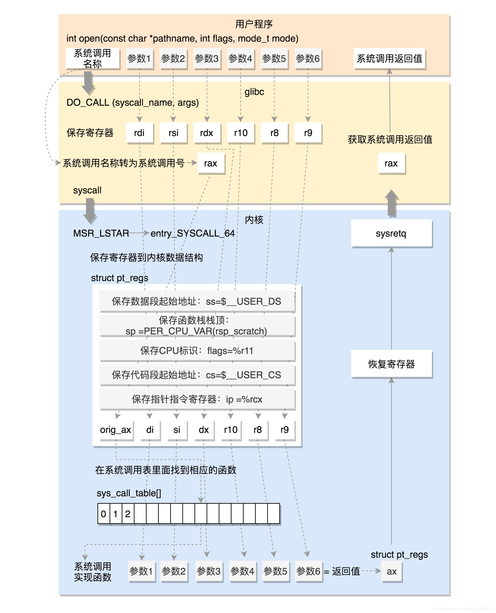

# 预备知识

## 内核通用数据结构

Linux内核中实现了通用的数据结构.包括链表(list_head),红黑树(rb_root,rb_node),哈希表(hlist),指针到整数的映射(idr),环形缓冲区(kfifo).与其说内核提供了这些数据结构,不如说内核提供了实现这些数据结构所必须的部分,同时提供了操作这些部分所需要的接口(函数或宏).

### 链表(list_head)

Linux内核使用C语言实现的数据结构与C++标准库中提供的数据结构实现方式差别很大.以链表为例,由于C++支持泛型,可以让链表中包含我们所需要的数据(下文称之为用户数据),而无需维护数据结构底层需要的指向前驱节点和后继节点的指针.由于c语言不支持泛型,所以需要让用户数据中包含链表的数据结构.
加入我们需要一个链表,这个链表中保存文件系统id到红黑树根节点的映射,在c语言里,需要在用户数据中明确写出list_head成员.

```c
// c的用户数据部分需要写明链表节点
struct list_head {
    struct list_head *next, *prev;
};

struct file_perm_list {
	struct list_head node;
	struct rb_root *root;
	fsid_t fsid;
};
```

```cpp
// c++用户数据只关心用户数据本身,无需关注std::list底层实现
struct file_perm {
	rb_root *root;
	fsid_t fsid;
};
std::list<file_perm> file_perm_list
```

在C++中,用户数据是对象中的数据,可以计算数据成员在对象内部的偏移定位.内核中的用户数据是在链表数据结构以外的数据,内核中巧妙的使用宏完成了对用户数据的定位.感兴趣可以看container_of宏的实现.此外还提供了各种常用操作的宏,例如获取第一个元素,遍历链表等

之前看到一句话,c++是让链表包含一切,c是让一切包含链表.这种实现方式在Linux内核中广泛应用,理解后阅读内核代码更方便.

### 红黑树(rb_root,rb_node)

内核中实现了红黑树的染色和平衡的操作(需要用户手动调用),在此之上的插入删除查找操作需要用户自行实现.红黑树的实现有一个特别精妙的设计,内核的红黑树节点在申请内存时,起始地址要求(至少)4字节对齐,这样最终申请下来的地址的最后两位永远是0,内核利用闲置的位,来表示节点颜色.

```c
struct rb_node {
	unsigned long  __rb_parent_color;
	struct rb_node *rb_right;
	struct rb_node *rb_left;
} __attribute__((aligned(sizeof(long))));

// 抹除后两位后表示父节点的指针
#define rb_parent(r)   ((struct rb_node *)((r)->__rb_parent_color & ~3))

// 用rb_node的__rb_parent_color最后一位表示当前节点颜色
#define __rb_color(pc)     ((pc) & 1)
#define rb_color(rb)       __rb_color((rb)->__rb_parent_color)
```

### 其他

其他数据结构目前没有用到,用到后可以补充

## 系统调用

找到了一张很棒的图,hook系统调用就是将图中sys_call_table数组中的函数指针替换为自己实现的版本.这部分内存开了写保护,修改时需要关闭写保护.开关写保护的方式不同处理器架构不同,在x86架构中,是要将cr0寄存器的第16位设置为0.



### 系统调用功能

open: 可以保护文件读写权限,以及父目录的创建文件权限
unlink: 删除文件
rename: 重命名文件

at结尾的系统调用,第一个参数是目录文件描述符,后续路径参数是相对于打开目录的相对路径.此外,AT_FDCWD是个特殊的文件描述符,用来表示当前进程的工作目录作为第一个参数的目录.这个路径可以通过当前任务的上下文获得.

## 文件系统

在内核中可以通过文件系统id和inode id,定位除内存文件系统中的任意文件.


## 进程调度

等待队列可以非常方便的让进程阻塞,在被唤醒时检查进程是否应该继续执行,实现代码也很简洁.

```c
// 声明等待队列
static DECLARE_WAIT_QUEUE_HEAD(wq);

// A 进程阻塞,直到condition为真时退出
wait_event_timeout(wq, condition, timeout);

// B 进程唤醒等待队列
wake_up(&wq);
```

在进程保护的实现里,A进程就是执行execve系统调用的进程,当这个进程把系统调用上报到应用层后阻塞.B进程时genl的进程,当收到应用层发来的结果后,唤醒A进程.由于可能同时存在多个A进程,在condition实现的过程中要进行特殊处理.

## 内核态与用户态通信

内核态与用户态通信中,使用最广泛是genl,genl是一个特殊的netlink协议.个人认为genl是为了解决netlink个数限制提出的.与内核中的驱动通信首先需要确定目标驱动,netlink通过一个整数来确定,整数的选择范围是0-31.而genl作为一个特殊的netlink协议,它占用了一个整数,在此之上实现了一个通过字符串定位驱动的框架.genl在内核中注册时,只需要给定一个唯一的字符串作为标记,用户态可以通过这个字符串找到对应的内核驱动.

genl实现了从命令(通过宏定义的一个整数,范围应该是没有限制)到回调函数的功能,用户只需要指定命令的回调函数即可,用户态在发送请求时携带这个命令.genl还提供了属性的概念,属性也是一个整数到基本数据类型的映射.通过属性传递数据,通过命令确定回调函数,就可以方便的处理用户态数据.

相比之下,更底层的netlink使用方式相对复杂.
